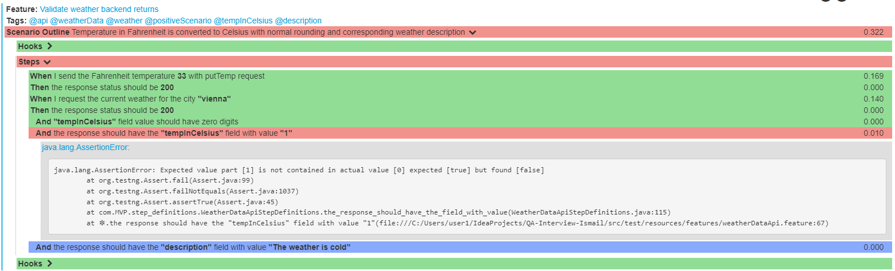
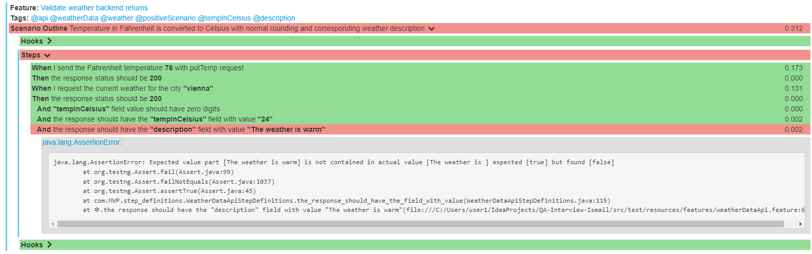
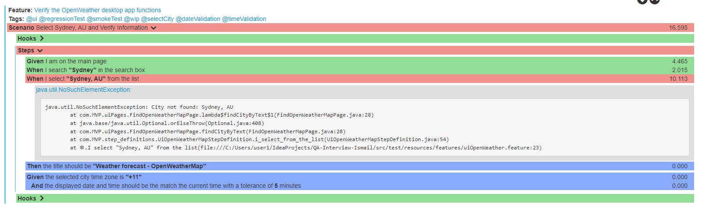

##### HOW TO RUN TESTS
```sh
 -> Under the runners package "CukesRunner" right click and run the class. "src > test > java > com > MVP > runners > CukesRunner"
 -> mvn clean verify --> In the IDE console or navigate project path in command line and run.
 -> mvn clean verify -DHEADLESS=true --> any browser-based tests should execute in headless mode, meaning without a graphical user interface
 -> mvn clean verify "-Dcucumber.filter.tags=@api" --> any specific test scenarios could run via mvn with anotations
 -> mvn clean verify -DBROWSER=chrome --> Also browser type can be controlled easily from command line with this command.
 -> mvn clean verify "-Dcucumber.filter.tags=@ui" -DBROWSER=chrome --> Both browserType and tags which wanted to run can control easily from the command line.
```

##### REPORT REVIEW
>- Cucumber report is generated under the target folder: `target/cucumber/cucumber-html-reports/overview-features.html`

##### UI & API TEST HANDLING
>- UI Test Failures (@ui): Automatically captures screenshots upon failure, providing crucial visual debug information.
>- API Test Failures (@api): Skips screenshot capture, as it's not applicable to non-UI tests.


##### THE RESULTS OF THE TEST REPORTS
#### API TEST SCENARIOS RESULTS

>- Totally 26 scenarios run and 5 of them failed depends on last run. This failed scenarios are listed like this:
    
>- **First Failure:**  When converting 33°F to Celsius, the precise result is approximately 0.56°C. Adhering to standard rounding conventions to the nearest whole number, this should be rounded up to 1°C. However, an observed discrepancy reveals the conversion was inaccurately rounded down to 0°C


>- **Second Failure** The expectation was for a temperature of 10 Degrees Celsius to be described as 'The weather is mild.' However, the actual description received was 'The weather is cold'.


>- **Third Failure:**  When converting 66°F to Celsius, the precise result is approximately 18.89°C. According to standard rounding conventions to the nearest whole number, this should be rounded up to 19°C. However, an observed discrepancy reveals the conversion was inaccurately rounded down to 18°C


>- **Forth Failure:**  The expectation was for a temperature of 20 Degrees Celsius to be described as 'The weather is warm.' However, the actual description received was 'The weather is '.


>- **Fifth Failure:**  The expectation was for a temperature of 24 Degrees Celsius to be described as 'The weather is warm.' However, the actual description received was 'The weather is '.


#### UI TEST SCENARIOS RESULTS
>- Totally 2 scenarios run and sometimes both of scenarios are passing, sometimes one of them is failing. Selected city list are not coming for every time, and specified element could not find.

>- Here is the one 2 scenarios passed result


- Ismail SONMEZ
- QA Automation Engineer     
